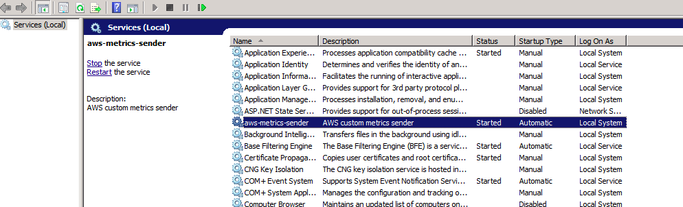
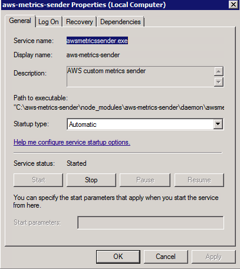
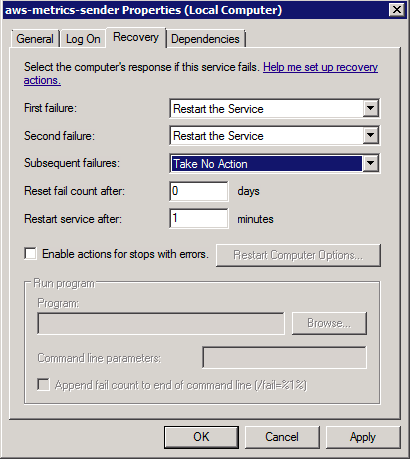

# aws-metrics-sender

This is a script that listens on the metrics file and sends added metrics to AWS Cloudwatch.

And yes, it's Windows-compatible

## Installation on Linux/Mac

1. install [nodejs](https://nodejs.org/en/download/)
2.  `npm install -g aws-metrics-sender`
3.  `aws-metrics-sender` command should be available now

## Installation on Windows
I'm not a big fan of Windows OS and it's quite likely that the following steps can be further simplified, but I ended up with the following working procedure to have aws-metrics-sender running as a windows service
1. install [nodejs](https://nodejs.org/en/download/). There's an `.msi` available so the installation is fairly straightforward
2. create a directory `C:\aws-metrics-sender` or any other directory convenient for you
3. `cd dir` where `dir` is the the directory from step 2.
4. `npm install aws-metrics-sender`
5. `cp node_modules\aws-metrics-sender .`
6. `npm install -g node-windows`
7. `npm link node-windows`
8. configure variables in `agent-service.js`
9. `node agent-service.js install`

If all went smoothly you'd see a new service **aws-metrics-sender** in the windows services:   

Here it is:  

It's also recommended to configure script restarts:     

If something goes wrong you can check out log files in the `node_modules\aws-metrics-sender\daemon` folder

To uninstall the service just run
`node agent-service.js uninstall`
